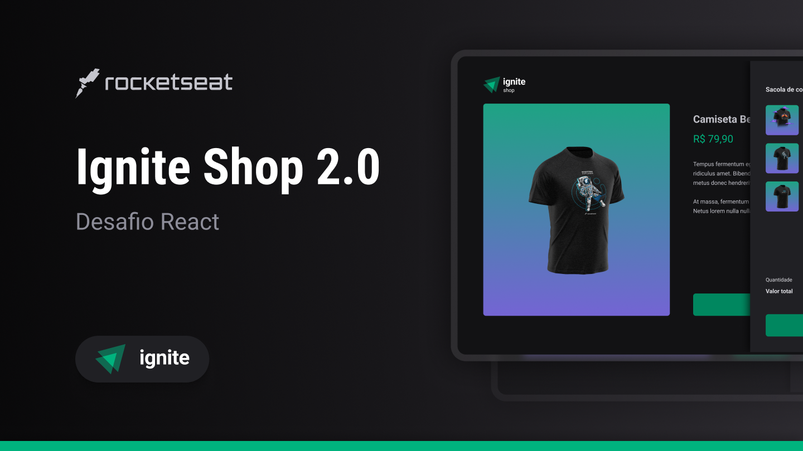

<h1 align="center">🛍️ Ignite Shop</h1>
<p align="center">Ignite | NextJS - Ignite Shop</p>

<p align="center">
  <a href="#-projeto">Projeto</a>&nbsp;&nbsp;&nbsp;|&nbsp;&nbsp;&nbsp;
  <a href="#-tecnologias">Tecnologias</a>&nbsp;&nbsp;&nbsp;|&nbsp;&nbsp;&nbsp;
  <a href="#-como-executar">Como Executar</a>&nbsp;&nbsp;&nbsp;|&nbsp;&nbsp;&nbsp;
  <a href="#-licença">Licença</a>&nbsp;&nbsp;&nbsp;|&nbsp;&nbsp;&nbsp;
  <a href="#-autor">Autor</a>
</p>

<p align="center">
  <a href="https://github.com/jordane-chaves/04-ignite-shop/blob/main/LICENSE">
    
  </a>
</p>

## 💻 Projeto

Ignite Shop é uma aplicação que simula uma loja online de camisas.

Essa aplicação foi desenvolvida durante um módulo do curso Ignite da Rocketseat, com o intuito de apresentar os conceitos do Next.js.
Foi muito interessante desenvolver esta aplicação pois além dos conceitos, pude integrar com o método de pagamentos da Stripe.

Após as aulas foi feito um desafio para adicionar os produtos em um "carrinho" antes do Checkout.
Fiz todas as alterações necessárias no layout do aplicativo e a implementação completa da funcionalidade de Carrinho (Sacola).

> O código desenvolvido durante as aulas deixei salvo na branch [without-cart](https://github.com/jordane-chaves/04-ignite-shop/tree/without-cart)

<p align="center">
  
</p>

## 🚀 Tecnologias

Esse projeto foi desenvolvido com as seguintes tecnologias:

- [TypeScript](https://www.typescriptlang.org/)
- [ReactJS](https://react.dev/)
- [NextJS](https://nextjs.org/)
- [StitchesJS](https://stitches.dev/)
- [RadixUI](https://www.radix-ui.com/)
- [Keen-Slider](https://keen-slider.io/)

## 🎲 Como executar

### Crie uma cópia do projeto.

```bash
# Clone este repositório
$ git clone https://github.com/jordane-chaves/04-ignite-shop.git

# Acesse o diretório do projeto no terminal/cmd
$ cd 04-ignite-shop

# Instale as dependências
$ npm install
```

### Executar a aplicação

```bash
# Crie uma cópia do arquivo .env.local.example e preencha as variáveis de ambiente
$ cp .env.local.example .env.local

# Execute a aplicação em modo de desenvolvimento
$ npm run dev

# A aplicação inciará na porta:3000 - acesse <http://localhost:3000>
```

## 📝 Licença

Esse projeto está sob a licença MIT - veja o arquivo [LICENSE](https://github.com/jordane-chaves/04-ignite-shop/blob/main/LICENSE) para mais detalhes.

## 👨🏻‍💻 Autor


Feito com 💜 por Jordane Chaves